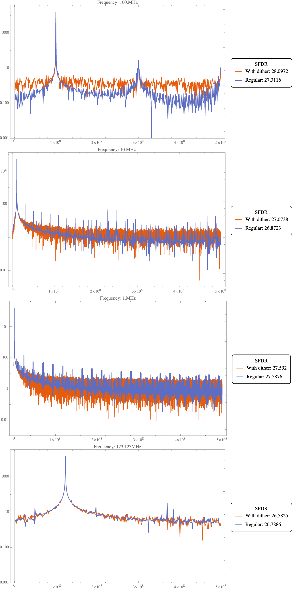

# FPGA_Homework_4



## LFSR
```verilog
module lfsr (clk, rst, out);

parameter OUT_SIZE=8;
parameter LFSR_POLY='b1101000000001000;
parameter LFSR_SEED = 'b1;

localparam LFSR_SIZE=$clog2(LFSR_POLY);

input clk;
input rst;
output [OUT_SIZE-1:0] out;

reg [LFSR_SIZE-1:0] LFSR;

assign out = LFSR[OUT_SIZE-1:0];

wire LFSR_next;

assign LFSR_next = ^(LFSR & LFSR_POLY);

always @(posedge clk or posedge rst) begin
    if (rst) begin
	    LFSR <= LFSR_SEED;
	end
	else begin
		LFSR <= {LFSR[LFSR_SIZE-2:0], LFSR_next};
	end
end
endmodule
```


## NCO
```verilog
module NCO(clk,
           rst,
           step,
           out);
    // Parameters
    parameter STEP_INTEGER_PART_WIDTH    = 8;
    parameter STEP_FRACTIONAL_PART_WIDTH = 8;
    localparam STEP_WIDTH                = STEP_INTEGER_PART_WIDTH + STEP_FRACTIONAL_PART_WIDTH;
    
    parameter LUT_ADDR_WIDTH = 8;
    parameter LUT_DATA_WIDTH = 10;
    localparam LUT_DATA_AMP  = 2**LUT_DATA_WIDTH;
    localparam LUT_SIZE      = 2**LUT_ADDR_WIDTH;
    localparam PERIOD        = 4*LUT_SIZE;
    localparam PERIOD_WIDTH  = LUT_ADDR_WIDTH+2;
    localparam PERIOD_1_2    = 2*LUT_SIZE;
    localparam PERIOD_1_4    = LUT_SIZE;

    // Inputs
    input clk;
    input rst;
    input [STEP_WIDTH-1:0] step;

    // Outputs
    output [LUT_DATA_WIDTH-1+1:0] out;

    // Code
    // Instantiate LFSR
    localparam LFSR_OUT_SIZE = STEP_FRACTIONAL_PART_WIDTH;
    wire [LFSR_OUT_SIZE-1:0] lfsr_out;
    lfsr #(.OUT_SIZE(LFSR_OUT_SIZE)) lfsr_module(.clk(clk),.rst(rst),.out(lfsr_out));

    // Generate LUT
    reg unsigned [LUT_DATA_WIDTH-1:0] LUT [LUT_SIZE-1:0];
    initial begin
        static real pi = $atan(1)*4.0;
        integer phase_index;
        $display("Generating LUT. LUT size is %d. LUT data width is %d",LUT_SIZE,LUT_DATA_WIDTH);
        for (phase_index = 0; phase_index < LUT_SIZE; phase_index = phase_index + 1) begin
            LUT[phase_index] = $floor($sin(2*pi*phase_index/LUT_SIZE/4)*(LUT_DATA_AMP-1));
//            $display(LUT[phase_index]);
        end
    end

    // Update phase
    reg [PERIOD_WIDTH+STEP_FRACTIONAL_PART_WIDTH-1:0] phase_accumulator;
    always @(posedge clk or posedge rst) begin
        if (rst) begin
            phase_accumulator <= 0;
        end
        else begin
            phase_accumulator <= phase_accumulator + step;
        end
    end
    wire [PERIOD_WIDTH+STEP_FRACTIONAL_PART_WIDTH-1:0] phase;
    assign phase = phase_accumulator + lfsr_out;

    // Update address
    wire [PERIOD_WIDTH-1:0] period_address;
    assign period_address = phase[PERIOD_WIDTH+STEP_FRACTIONAL_PART_WIDTH-1:STEP_FRACTIONAL_PART_WIDTH];

    wire sign;
    assign sign = period_address <= PERIOD_1_2;
    wire reverse;
    assign reverse = ((PERIOD_1_4<=period_address)&&(period_address<PERIOD_1_2))||(((PERIOD_1_4+PERIOD_1_2)<=period_address)&&(period_address<PERIOD));

    wire [1:0] quarter_period_idx = {!sign, reverse};
    wire [LUT_ADDR_WIDTH-1:0] quarter_period_address;
    assign quarter_period_address = period_address-quarter_period_idx*PERIOD_1_4;

    wire [LUT_ADDR_WIDTH-1:0] LUT_address;
    assign LUT_address = (reverse?(PERIOD_1_4-1-quarter_period_address):(quarter_period_address));

    // Write to out
    assign out = LUT_DATA_AMP+1 + (sign?1:-1)*LUT[LUT_address];
endmodule

```

## Testbench
```python
import cocotb
from cocotb.triggers import Timer
import numpy as np
from matplotlib import pyplot as plt
from binary_fractions import Binary


async def clock_cycle(dut):
    dut.clk.value = 0
    await Timer(0.5, units="ns")
    dut.clk.value = 1
    await Timer(0.5, units="ns")


async def generate_clock(dut, num_clocks):
    for cycle in range(num_clocks):
        await clock_cycle(dut)


async def reset(dut):
    dut.rst.value = 1
    await Timer(1, units="ns")
    dut.rst.value = 0
    await Timer(1, units="ns")


@cocotb.test()
async def test(dut):
    # Set step
    step_integer_part_width = int(dut.STEP_INTEGER_PART_WIDTH.value)
    step_fractional_part_width = int(dut.STEP_FRACTIONAL_PART_WIDTH.value)
    step_width = int(dut.STEP_WIDTH.value)
    period = int(dut.PERIOD.value)
    desired_frequency = 100e6
    samplingFrequency = 1e9
    step = period * desired_frequency / samplingFrequency
    dut.step.value = int(step * (2 ** step_fractional_part_width))
    periods = 100
    clock_cycles = int(1. * period * periods / step)

    await reset(dut)

    await cocotb.start(generate_clock(dut, 1))

    out_data = np.zeros(clock_cycles)
    for i in range(clock_cycles):
        out_data[i] = dut.out.value
        await clock_cycle(dut)

    await Timer(10, units="ns")

    out_data_fft = np.abs(np.fft.rfft(out_data, norm="forward"))
    out_data_fft[0] = 0
    out_data_freq = np.array(range(len(out_data_fft))) / len(out_data_fft)

    plt.plot(out_data_freq, out_data_fft, linewidth=0.8)
    plt.yscale("log")
    plt.ylim([1e-3, 1e3])
    # plt.xlim([0, 0.1])
    plt.show()

    with open('../data.txt', 'w') as f:
        for out in out_data:
            f.write(f"{out}\n")


async def run_and_dump(dut, desired_frequency):
    # Set step
    step_integer_part_width = int(dut.STEP_INTEGER_PART_WIDTH.value)
    step_fractional_part_width = int(dut.STEP_FRACTIONAL_PART_WIDTH.value)
    step_width = int(dut.STEP_WIDTH.value)
    period = int(dut.PERIOD.value)
    samplingFrequency = 1e9
    step = period * desired_frequency / samplingFrequency
    dut.step.value = int(step * (2 ** step_fractional_part_width))
    periods = 100
    clock_cycles = int(1. * period * periods / step)

    await reset(dut)

    await cocotb.start(generate_clock(dut, 1))

    out_data = np.zeros(clock_cycles)
    for i in range(clock_cycles):
        out_data[i] = dut.out.value
        await clock_cycle(dut)

    await Timer(10, units="ns")

    with open(f'../text_files/data_dither_{desired_frequency}.txt', 'w') as f:
        for out in out_data:
            f.write(f"{out}\n")


@cocotb.test()
async def test_sweep(dut):
    freq_list = [1e6,10e6,100e6,123.123123e6]
    for freq in freq_list:
        await run_and_dump(dut, freq)
```